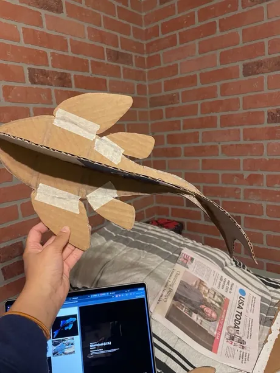

<div align="center">

#  Fish and Chips 

Mobile web remote for joseph — a pleco catfish-shaped LED light in my room, running WLED on an ESP32 over WiFi.

**Live at : (https://prachidpatel.github.io/fish-and-chips/)**

---

## How it works

</div>

1. Connect to the same local WiFi as joseph
2. Connect him to your local network (optional) 
3. Pick a preset or paint a pattern
4. MQTT message fires -> WLED picks it up -> joseph changes color

Can be used from any device, especially designed with mobile in mind.
<div align="center">

##  Features 

</div>

- **Mood presets** — happy,sad, angry, and a few others
- **Time presets** - morning and evening
- **Pixel painter** — draw a custom pattern directly onto the LED grid and push it live
- **Snake** — yes there is a snake game on the fish

<div align="center">

##  Setup 

</div>

This repo is a template — the real broker URL and WLED topic are not committed. 

1. Open `index.html` locally
2. Fill in the `CONFIG` block at the top of the script:
   ```js
   const BROKER = 'wss://your-broker.com:8084/mqtt';
   const TOPIC  = 'wled/your-device-id/api';
   ```
3. Open the file directly in your browser — no server needed

Keep your filled-in copy local and never push it.

<div align="center">

##  Stack 

</div>

- ESP32 + WLED
- MQTT via EMQX over WiFi
- HTML / CSS / JavaScript

<div align="center">

##  How Joseph Was Built 



Cardboard to fish — every LED is individually mapped to the site, so I can repaint or animate him whenever I want.

</div>
